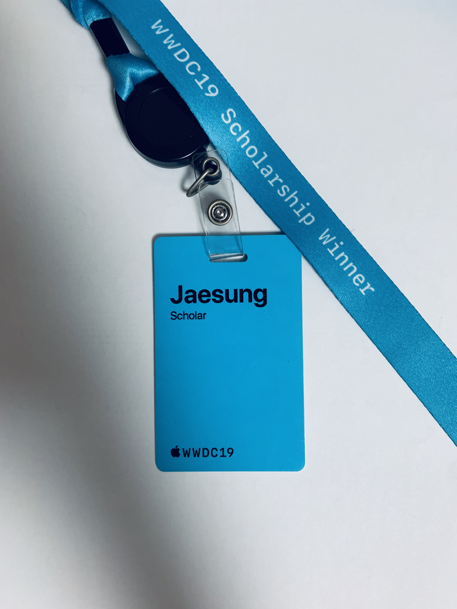

#  WWDC19 Scholarship

## Jaesung

### 주제: Learning CPR in AR / 3D

### 사용한 프레임워크
ARKit, SceneKit, AVFoundation, UIKit

### 사용한 프로그램
Xcode, Swift Playground, Blender(3D animations), Keynote(Images)

